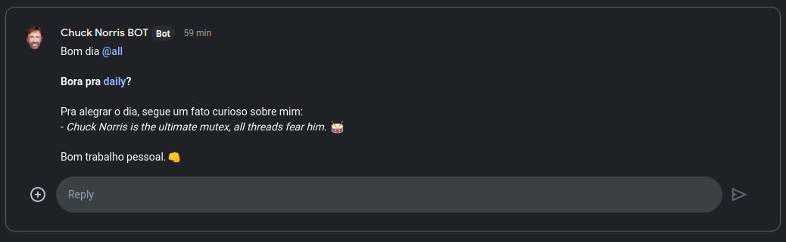

# google-daily-bot

## Screenshot
<h1 align="center">
  
</h1>

## Requirements
To be able to parse a JSON that chucknorris API returns, you need the cli [JQ](http://www.compciv.org/recipes/cli/jq-for-parsing-json/). 
* JSON is a lightweight format that is nearly ubiquitous for data-exchange. jq is a command-line tool for parsing JSON.


## How to run
Configure `daily-bot.sh` and run:
```bash
bash daily-bot.sh
```

## Configure crontab:
This config allways run bash every weekday 09:45 AM. 
To other config, look: https://crontab.guru/
```bash
55 09 * * 1-5 /PATH/PROJECT/FILE/daily-bot/daily-bot.sh >> /PATH/PROJECT/FILE/daily-bot/history.log 2>&1
```

References:
- https://developers.google.com/chat/how-tos/webhooks
- https://developers.google.com/chat/api/guides/message-formats